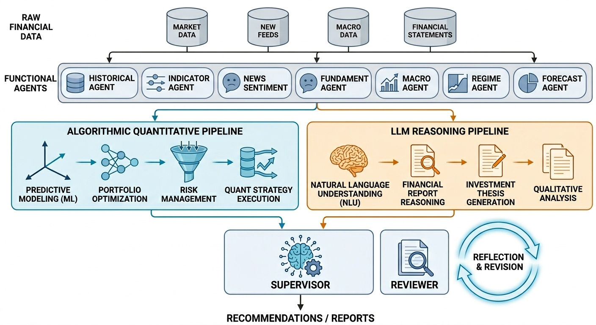
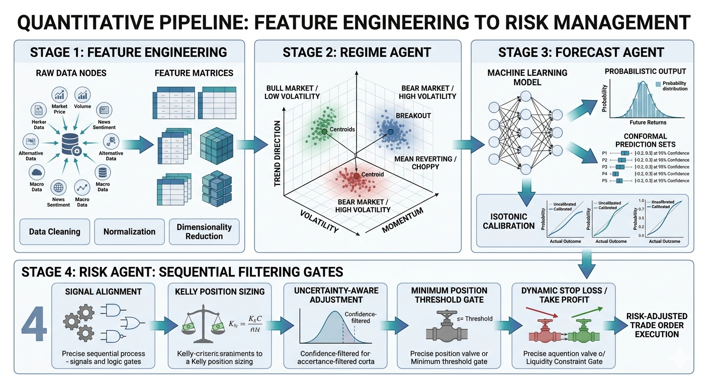
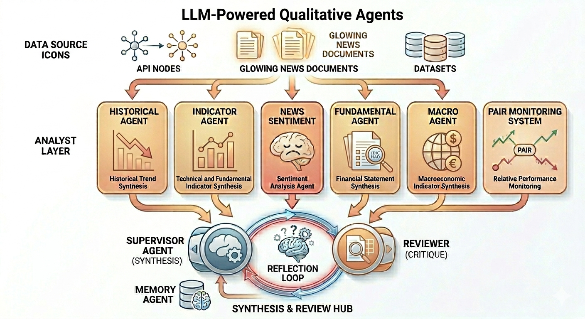

<p align="center">
  
</p>

<div align="center">


**A precision-engineered multi-agent financial advisory system that fuses LLM reasoning with quantitative ML models for institutional-grade stock analysis.**

[Architecture](#architecture) · [Quant Pipeline](#-the-quantitative-pipeline-what-sets-us-apart) · [Quick Start](#-quick-start) · [Backtest](#-backtest-engine) · [Configuration](#-configuration)

</div>

---

## Why AlphaAgent?

Most LLM-based trading frameworks treat the market as a **text comprehension problem** — feeding news and financials into language models and hoping for good decisions. AlphaAgent takes a fundamentally different approach:

> **LLMs handle what they're good at (reasoning, synthesis, review). ML models handle what they're good at (pattern recognition, probability estimation). Neither substitutes for the other.**

| Capability | Typical LLM Trading Framework | AlphaAgent |
|:---|:---|:---|
| Forecast Method | LLM text reasoning | **LightGBM probabilistic model** with Isotonic calibration |
| Uncertainty Quantification | ❌ None | ✅ **Conformal prediction sets** + tree dispersion |
| Position Sizing | Fixed or LLM-suggested | **Prediction-Kelly criterion** (continuous, probability-scaled) |
| Regime Awareness | ❌ or basic | **3D regime classifier** (Trend × Volatility × Momentum) + Markov smoothing |
| Risk Control | LLM-generated advice | **Algorithmic**: signal alignment, dynamic stops, uncertainty gates |
| Self-Calibration | ❌ None | ✅ **Memory Agent** tracks prediction accuracy → adjusts position sizing |
| Validation | Manual inspection | **4-stage ablation backtest** with walk-forward engine |
| Reflection | ❌ None | ✅ **Reviewer Agent** critiques draft → Supervisor revises |

---

## Architecture

<p align="center">
  
</p>

AlphaAgent decomposes financial analysis into **15 specialized agents** organized in a **layered dependency graph** with parallel execution:

```
                          ┌─────────────────────────────────────────────┐
                          │              Layer 0 (Parallel)             │
                          │                                             │
                          │  ┌──────────┐ ┌──────────┐ ┌────────────┐  │
                          │  │Historical│ │Indicator │ │   News     │  │
                          │  │  Agent   │ │  Agent   │ │ Sentiment  │  │
                          │  └──────────┘ └──────────┘ └────────────┘  │
                          │  ┌──────────┐ ┌──────────┐ ┌────────────┐  │
                          │  │ Feature  │ │Fundament.│ │   Macro    │  │
                          │  │ Engineer │ │  Agent   │ │   Agent    │  │
                          │  └────┬─────┘ └──────────┘ └────────────┘  │
                          │  ┌────┴─────┐ ┌──────────┐                 │
                          │  │  Pair    │ │  Macro   │                 │
                          │  │ Ledger   │ │Fund.Feat.│                 │
                          │  └────┬─────┘ └────┬─────┘                 │
                          └───────┼────────────┼───────────────────────┘
                                  │            │
                          ┌───────┼────────────┼───────────────────────┐
                          │       │  Layer 1   │                       │
                          │  ┌────┴─────┐ ┌────┴─────┐                 │
                          │  │  Pair    │ │  Regime  │                 │
                          │  │ Monitor  │ │  Agent   │                 │
                          │  └──────────┘ └────┬─────┘                 │
                          └────────────────────┼───────────────────────┘
                                               │
                          ┌────────────────────┼───────────────────────┐
                          │       Layer 2      │                       │
                          │              ┌─────┴─────┐                 │
                          │              │ Forecast  │                 │
                          │              │   Agent   │                 │
                          │              └─────┬─────┘                 │
                          └────────────────────┼───────────────────────┘
                                               │
                          ┌────────────────────┼───────────────────────┐
                          │       Layer 3      │                       │
                          │              ┌─────┴─────┐                 │
                          │              │   Risk    │                 │
                          │              │   Agent   │                 │
                          │              └─────┬─────┘                 │
                          └────────────────────┼───────────────────────┘
                                               │
                          ┌────────────────────┼───────────────────────┐
                          │       Layer 4      │                       │
                          │  ┌─────────────────┴──────────────────┐    │
                          │  │         Supervisor Agent           │    │
                          │  │  (Synthesize all agent outputs)    │    │
                          │  └─────────────────┬──────────────────┘    │
                          │                    │                       │
                          │  ┌─────────────────┴──────────────────┐    │
                          │  │         Reviewer Agent             │    │
                          │  │  (Critique → Revise if needed)     │    │
                          │  └────────────────────────────────────┘    │
                          └────────────────────────────────────────────┘
```

**Key design principle**: Each layer only depends on the layers above it. Layer 0 agents run **fully in parallel**, minimizing wall-clock time.

---

## 🔬 The Quantitative Pipeline (What Sets Us Apart)

<p align="center">
  
</p>

This is where AlphaAgent diverges from text-only frameworks. The quant pipeline is a **4-stage chain** where each stage adds measurable alpha, validated through ablation testing:

### Stage 1: Feature Engineering Agent

Computes **15+ ML-ready features** from raw OHLCV data:

| Category | Features |
|:---|:---|
| Momentum | 5d/10d/20d returns, MACD signal, RSI |
| Volatility | 20d realized vol, Bollinger bandwidth, ATR ratio |
| Volume | Volume pressure (OBV slope), volume ratio |
| Trend | SMA cross signals, drawdown from high |
| Macro/Fundamental | VIX, yield curve, financial health score, debt-to-equity (24 features) |

### Stage 2: Regime Agent — 3D Market Classifier

Our Regime Agent classifies markets across **three independent dimensions**:

```
Dimension 1: Trend          → strong_uptrend | uptrend | neutral | downtrend | strong_downtrend
Dimension 2: Volatility     → low | normal | high | extreme  (+ expansion flag)
Dimension 3: Momentum Health → accelerating | steady | decelerating | exhausted
```

These combine into **9 actionable composite regimes**: `strong_rally`, `trending_up`, `topping_out`, `range_bound`, `coiling`, `choppy`, `trending_down`, `bottoming_out`, `capitulation`.

**Advanced features**:
- **Markov transition smoothing** — Uses a learned transition probability matrix to suppress impossible regime jumps (e.g., `strong_rally` → `capitulation` in one step)
- **Regime features feed into LightGBM** — Compressed ordinal encoding (direction + volatility ordinal + momentum health) as model input features, not just labels
- **Optional Dimension 4: Macro Regime** — `risk_on` / `neutral` / `risk_off` derived from VIX, yield curve, SPY momentum

### Stage 3: Forecast Agent — Probabilistic ML Predictions

The Forecast Agent is **not an LLM** — it's a trained **LightGBM binary classifier** with rigorous statistical calibration

**Why this matters**:
- **Conformal prediction** provides distribution-free coverage guarantees — if the prediction set contains both `{up, down}`, the model is genuinely uncertain and the Risk Agent **rejects the trade**
- **Isotonic calibration** ensures that when the model says "70% probability up", it actually goes up ~70% of the time
- **Tree dispersion** (variance across LightGBM trees) provides a second, independent uncertainty signal
- **3-tier fallback**: LightGBM → Ridge regression → hand-tuned heuristic, ensuring the system never crashes

### Stage 4: Risk Agent — Algorithmic Position Sizing

The Risk Agent converts probabilistic forecasts into executable risk plans through a **multi-gate pipeline**:

```
Gate ①  Signal Alignment    — Regime vs Forecast direction conflict check
        ↳ alignment < 0.4 → reject (unless high-confidence override: |prob - 0.5| > 0.35)

Gate ②  Prediction-Kelly    — Position size = f(predicted probability, historical win/loss ratio)
        ↳ Scales continuously with signal strength (not fixed lots)

Gate ③  Uncertainty Gates   — Conformal set = {up,down} → reject
                             — Tree dispersion > 0.15 → halve position

Gate ④  Direction & Sizing  — Apply direction sign, enforce max position

Gate ⑤  Track Record Factor — Memory Agent accuracy → scale position [0.3, 1.1]

Gate ⑥  Min Position Filter — |position| < 3% → reject (not worth execution cost)

Gate ⑦  Dynamic Stop-Loss   — 2.5× daily volatility, clamped to [1%, 8%]
        ↳ Take-profit = stop-loss × risk-reward ratio (default 2:1)
```

**Every gate is ablation-tested** — we verified each component's marginal contribution through our 4-stage debug framework.

---

## 🧠 LLM-Powered Qualitative Agents

<p align="center">
  
</p>

While the quant pipeline handles numbers, LLM agents handle **context, reasoning, and synthesis**:

### Analyst Layer

| Agent | Role | Data Source |
|:---|:---|:---|
| **Historical Agent** | Price trend analysis, support/resistance, volume patterns | Alpha Vantage |
| **Indicator Agent** | Multi-timeframe RSI signals, divergence detection, channel regimes | Alpha Vantage |
| **News Sentiment Agent** | Real-time news sentiment scoring with impact assessment | DuckDuckGo + Tavily |
| **Fundamental Agent** | Financial health, valuation metrics, earnings analysis | Alpha Vantage |
| **Macro Agent** | Macroeconomic environment, Fed policy, sector rotation | Alpha Vantage |

### Pair Monitoring System

| Agent | Role |
|:---|:---|
| **Pair Ledger Agent** | Builds persistent momentum-similar stock pairs (top 100 S&P 500, correlation > 0.85) |
| **Pair Monitor Agent** | Detects spread z-score divergence → flags leading/lagging moves |

### Synthesis & Review

| Agent | Role |
|:---|:---|
| **Supervisor Agent** | Synthesizes all 13 agent outputs into a final BUY/SELL/HOLD recommendation |
| **Reviewer Agent** | **Reflection loop** — critiques the draft for overlooked risks, logic gaps, confidence miscalibration |
| **Memory Agent** | Tracks historical prediction accuracy → feeds back into position sizing |

> The **Reflection Loop** is a key differentiator: the Reviewer Agent acts as a risk-control officer, cross-checking the Supervisor's draft against raw agent data. If issues are found, the Supervisor **revises** the recommendation before output.

---

## 📊 Backtest Engine

AlphaAgent includes a production-grade **Agent-in-the-Loop walk-forward backtest engine**:

```bash
python scripts/run_backtest.py --ticker AAPL --start 2023-01-01 --end 2025-12-31
```

**Execution model**: Signal at Close → Execute at Next Open (realistic, no lookahead).

### Evaluation Metrics (17+ indicators)

| Category | Metrics |
|:---|:---|
| Returns | Total return, Alpha (vs buy-and-hold), Avg trade return |
| Risk-Adjusted | Sharpe ratio, Sortino ratio, Profit factor |
| Drawdown | Max drawdown, drawdown duration |
| Signal Quality | Hit rate, Trade IC, N trades (buy/sell breakdown) |
| Exit Analysis | Stop-loss / Take-profit / Horizon exit rates and avg returns |
| Per-Regime | Breakdown by regime state (hit rate, contribution, avg return) |

### 4-Stage Ablation Debug Framework

We provide a **systematic debug toolkit** to validate each agent's marginal contribution:

```
Stage 0: Signal IC           — Raw feature predictive power (no agents)
Stage 1: Forecast Only       — LightGBM predictions, threshold sweep
Stage 2: Forecast + Risk     — Add position sizing, stops, uncertainty gates
Stage 3: + Regime Agent      — Add regime features, signal alignment, ablation variants
```

```bash
# Example: Stage 3 ablation with multiple variants
python scripts/debug_stage3_regime.py \
  --ticker AAPL \
  --start 2023-01-01 \
  --end 2025-12-31 \
  --rounds v0,v1,v1b,v1b_C
```

## 🚀 Quick Start

### Installation

```bash
git clone <your-repo-url>
cd alphaagent

# Create environment
conda create -n alphaagent python=3.10
conda activate alphaagent

# Install dependencies
pip install -r requirements.txt
```

### Required API Keys

```bash
cp .env.example .env
```

Edit `.env` with your keys:

```bash
OPENAI_API_KEY=your_openai_key          # Required: LLM reasoning
ALPHAVANTAGE_API_KEY=your_av_key        # Required: Market data
TAVILY_API_KEY=your_tavily_key          # Optional: Enhanced news search
```

### Run Analysis

```bash
# Interactive CLI
python main.py

# Programmatic usage
python example_usage.py
```

### Train the Forecast Model

```bash
# Train LightGBM on S&P 500 top 100 stocks with Purged K-Fold CV
python pipelines/train_forecast_model.py
```

### Python API

```python
from agents import (
    FeatureEngineeringAgent, RegimeAgent, ForecastAgent,
    RiskAgent, SupervisorAgent, MemoryAgent,
)

# Quantitative pipeline (no LLM needed)
feature_agent = FeatureEngineeringAgent()
regime_agent = RegimeAgent()
forecast_agent = ForecastAgent()
risk_agent = RiskAgent()

# Run the quant chain
features = feature_agent.analyze("AAPL")
regime = regime_agent.analyze("AAPL", features)
forecast = forecast_agent.analyze("AAPL", features, regime)
risk = risk_agent.analyze("AAPL", forecast, regime, features)

print(f"Action: {forecast['forecast']['action']}")
print(f"P(up): {forecast['forecast']['probability_up']:.3f}")
print(f"Position: {risk['risk_plan']['position_size_fraction']:.3f}")
print(f"Stop-loss: {risk['risk_plan']['stop_loss_pct']:.3f}")
```

---

---

## ⚙ Configuration

### Core Settings

| Variable | Default | Description |
|:---|:---|:---|
| `OPENAI_MODEL` | `gpt-4o` | LLM model for qualitative agents |
| `OPENAI_TEMPERATURE` | `0.3` | LLM temperature |
| `FORECAST_MODEL_PATH` | `data/forecast_model.json` | Trained model path |
| `FORECAST_HORIZON_DAYS` | `5` | Prediction horizon |
| `FORECAST_BUY_THRESHOLD` | `0.55` | P(up) threshold for buy signal |
| `FORECAST_SELL_THRESHOLD` | `0.45` | P(up) threshold for sell signal |
| `FORECAST_MODEL_VERSION` | `v1` | `v1` (single-stock) or `v2` (cross-sectional) |

### Regime Settings

| Variable | Default | Description |
|:---|:---|:---|
| `REGIME_HIGH_VOL_THRESHOLD` | `0.35` | High volatility boundary |
| `REGIME_LOW_VOL_THRESHOLD` | `0.16` | Low volatility boundary |
| `REGIME_EXTREME_VOL_THRESHOLD` | `0.50` | Extreme volatility boundary |
| `REGIME_TRANSITION_MATRIX_PATH` | `data/regime_transition_matrix.json` | Markov transition matrix |

### Risk Settings

| Variable | Default | Description |
|:---|:---|:---|
| `RISK_TARGET_ANNUAL_VOL` | `0.12` | Target annual volatility |
| `RISK_MAX_POSITION_SIZE` | `1.0` | Maximum position fraction |
| `RISK_REWARD_RATIO` | `2.0` | Take-profit / stop-loss ratio |

### Pair Monitoring

| Variable | Default | Description |
|:---|:---|:---|
| `PAIR_UNIVERSE_PATH` | `data/sp500_top100.json` | Ticker universe |
| `PAIR_LOOKBACK_DAYS` | `90` | Correlation lookback window |
| `PAIR_TOP_K` | `5` | Number of pairs per stock |
| `PAIR_MIN_CORR` | `0.85` | Minimum correlation threshold |
| `PAIR_ZSCORE_THRESHOLD` | `1.5` | Divergence detection threshold |

### Storage

| Variable | Default | Description |
|:---|:---|:---|
| `STORAGE_ENABLED` | `true` | Enable persistence |
| `STORAGE_URL` | `sqlite:///data/agent_store.db` | Database connection string |

> Supports SQLite (default) and PostgreSQL (`psycopg2-binary` required).

---

## 📁 Project Structure

```
alphaagent/
├── agents/                          # 15 specialized agents
│   ├── feature_engineering_agent.py # ML feature computation
│   ├── regime_agent.py              # 3D market regime classifier
│   ├── forecast_agent.py            # LightGBM probabilistic forecaster
│   ├── risk_agent.py                # Algorithmic position sizing
│   ├── memory_agent.py              # Self-calibration from track record
│   ├── supervisor_agent.py          # LLM synthesis & recommendation
│   ├── reviewer_agent.py            # Reflection loop critique
│   ├── historical_agent.py          # Price trend analysis (LLM)
│   ├── indicator_agent.py           # Multi-TF RSI signals (LLM)
│   ├── news_sentiment_agent.py      # News sentiment (LLM)
│   ├── fundamental_agent.py         # Financial health (LLM)
│   ├── macro_agent.py               # Macro environment (LLM)
│   ├── ledger_agent.py              # Pair construction
│   ├── pair_monitor_agent.py        # Pair divergence detection
│   └── backtest_agent.py            # Lightweight strategy check
├── backtest/
│   ├── engine.py                    # Walk-forward backtest engine
│   └── evaluator.py                 # 17+ metric evaluation suite
├── pipelines/
│   ├── train_forecast_model.py      # LightGBM training (Purged K-Fold)
│   └── track_outcomes.py            # Prediction outcome tracking
├── scripts/
│   ├── run_backtest.py              # Production backtest runner
│   ├── debug_stage0_signal_ic.py    # Stage 0: Signal IC analysis
│   ├── debug_stage1_forecast_only.py# Stage 1: Forecast-only backtest
│   ├── debug_stage2_forecast_risk.py# Stage 2: + Risk agent
│   ├── debug_stage3_regime.py       # Stage 3: + Regime ablation
│   └── build_regime_matrix.py       # Build transition matrix
├── utils/
│   ├── macro_fundamental_provider.py# Macro/fundamental feature extraction
│   ├── cross_sectional_service.py   # Cross-sectional rank features (V2)
│   ├── storage.py                   # SQLite/PostgreSQL persistence
│   └── yfinance_cache.py            # Market data caching
├── orchestrator.py                  # Pipeline orchestrator (parallel execution)
├── main.py                          # CLI entry point (Rich UI)
└── example_usage.py                 # Quick-start example
```

---

## 🔮 Roadmap

- [ ] **V2 Cross-Sectional Model** — 100-stock universe with rank features and industry encoding
- [ ] **Intraday Signals** — Sub-daily feature engineering and regime detection
- [ ] **Portfolio-Level Optimization** — Multi-stock allocation with correlation-aware sizing
- [ ] **Live Trading Integration** — Broker API connectivity (Alpaca, Interactive Brokers)
- [ ] **Multi-LLM Support** — Google Gemini, Anthropic Claude, local Ollama models

---

## Dependencies

| Package | Purpose |
|:---|:---|
| `langchain` + `langchain-openai` | LLM orchestration |
| `langgraph` | Multi-agent workflow |
| `lightgbm` | Forecast model |
| `scikit-learn` | Calibration, cross-validation |
| `pandas` + `numpy` | Data processing |
| `yfinance` | Market data |

| `tavily-python` + `duckduckgo-search` | News search |

---

<div align="center">

**Built with precision. Validated with rigor. Designed for alpha.**

</div>
